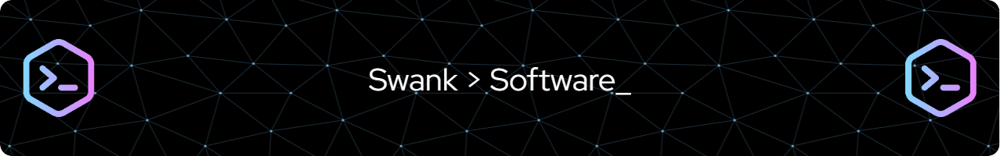

<!--img src="header1.svg" width="50%" height="300" align="left"-->
<!--img align="right" src="https://github-readme-stats.vercel.app/api/top-langs/?username=JCoombs224&theme=react&layout=compact&hide=CMake&exclude_repo=Data-Structures-and-Algorithms,CS421-Translator,CS421-Parser-Project&langs_count=8," width="40%" height="275"-->

   
  I'm a Computer Science graduate from California State University, San Marcos, with a genuine passion for all facets of computing — both hardware and software. 
  At present, I hold a position as a Software QA Engineer at Boeing. My technical expertise encompasses a broad range of programming languages, including Java, 
  C++, Python, and more. You're welcome to review some of my work in the repositories linked here.

<!--
**d-swank/d-swank** is a ✨ _special_ ✨ repository because its `README.md` (this file) appears on your GitHub profile.

Here are some ideas to get you started:

- 🔭 I’m currently working on ...
- 🌱 I’m currently learning ...
- 👯 I’m looking to collaborate on ...
- 🤔 I’m looking for help with ...
- 💬 Ask me about ...
- 📫 How to reach me: ...
- 😄 Pronouns: ...
- ⚡ Fun fact: ...
-->
